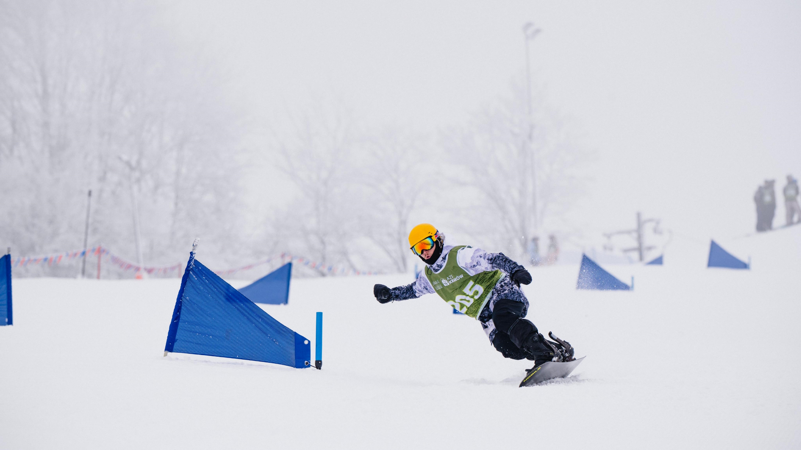
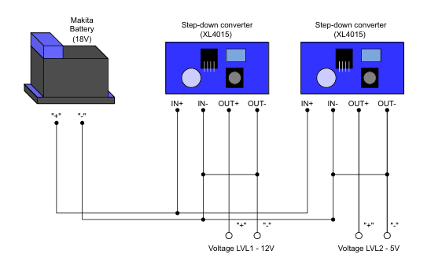
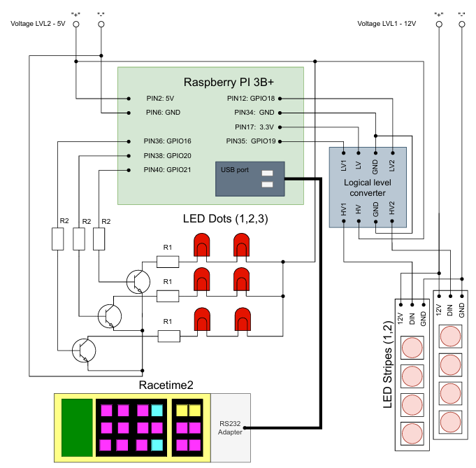
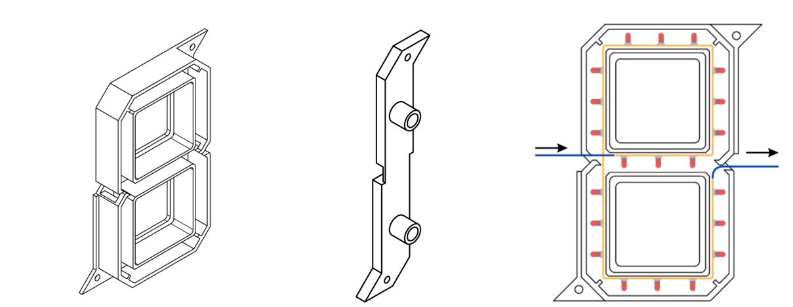
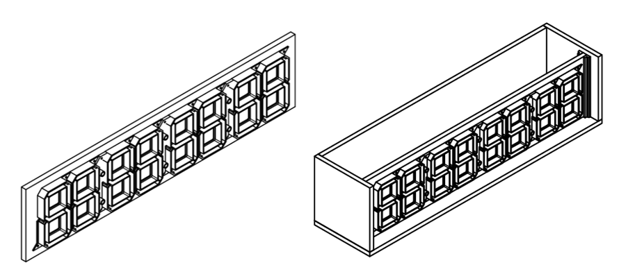
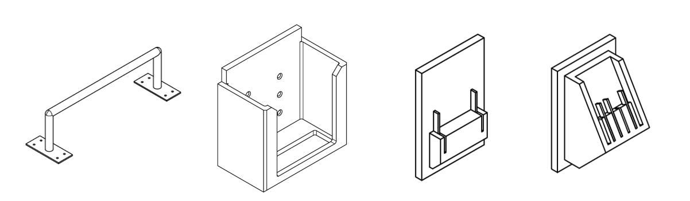
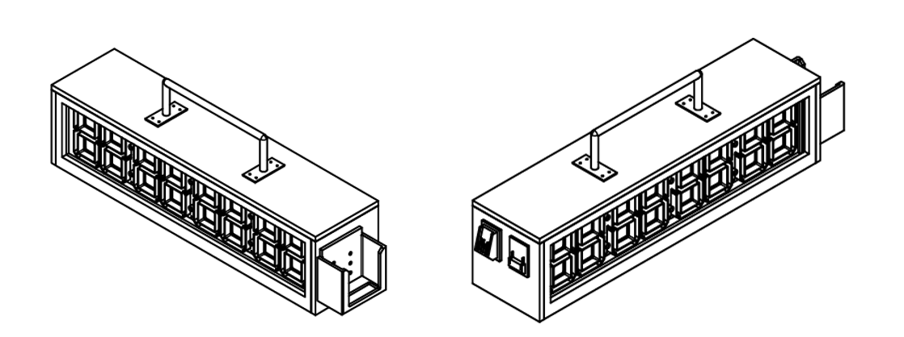

# 7-Segment RaceTime Display System

## Project Overview
This project is the practical implementation of my engineering thesis, focused on building a **real-time sports timing and visualization system**.  
It integrates with the **RaceTime** timing device and uses a **Raspberry Pi** as the central controller to:

- receive and parse data frames from RaceTime,
- compute and synchronize the race time,
- display results on a **7-segment LED display**,
- handle additional visual signals (status LEDs).

The system was designed for **sports competitions**, ensuring clear, reliable, and immediate feedback for athletes and organizers.  It is optimized to run in a **standalone mode**, starting automatically on boot and tolerant to sudden power-offs.



As a starting point, implementation is considered to be used with Time Control for **Snowboarding Slalom**, mostly as a device cooperating with Microgate appliances for measuring times.

---

## Key Features
- **Real-time display** of RaceTime measurements.  
- Automatic detection of race events:  
  - **Start** → measurement begins,  
  - **Finish** → time stops, blinks for 5 seconds, then clears,  
  - **No signal** → warning indication on the rightmost digit.  
- **Error handling**: time drift correction based on RaceTime sync frames.  
- **Auto-start on boot** with `systemd`.  
- Power-loss resistant (read-only filesystem logs, no manual shutdown required).  

---

## Hardware implementation
Device's architecture is devided into smaller parts by functionalities:
- **Power unit** - whole system is being powered by battery used in Makita electrical appliances. The choice was made by simple idea - such battery is being used in field, while putting slalom pole's on the racing place. It was considered convinient to share power supply in order to reduce the ammount of appliances needed to be loaded up. Such battery delivers 18V DC - to achieve requested voltage levels, the combination of two step-down converters *XL4015* are used:
    -  **5V** - powering RPi, level converter (to convert level of signals controlling led stripes) and dots, that are marking the meaning of digits,
    -  **12V** - powering led stripes,

- **Control unit** - whole control of system's behavior is conducted by it's heart - *RaspberryPi 3B+* microcomputer. It's GPIO ports are being used to control the data that is printed on LED Stripes and Dots. As an input, system recieves data frames from Time Control System - *RaceTime2* - a chronometr, that communicates with starting and ending gate, which sends the signals of start and finish of users ride on the track.

- **Execution unit** - main part, which perform devices functionalities. Consists of:
  - LED Stripes - programmable led stripes *WS2811*, put in 3D printed slots - each having 7 segments, which combination prints out digits,
  - LED Dots - pairs of LEDs, controlled by transistor *BC547B*.
-  **Communication unit** - to achieve communication between microcomputer and chronometr, connection is maintained by *USB-RS232 Connector*.
  
## Electrical diagram

- **Power circuit**
  


- **Execution circuit**



---

## Mechanical Parts 

Due to the specific requirements of the project, most of the custom-shaped components were 3D printed from PLA material. The most relevant parts briefly described in this study are:

- **Socket for LED strips** (left)  
- **Separator between sockets** (middle)  

To ensure that the correct LEDs are illuminated, the proper order of printing and placement was carefully selected. The arrangement is presented on the right side of the image below.  



All sockets and separators are mounted on a **supporting plate**, which is enclosed in a box.  
The **walls of the box** were not 3D-printed due to their large size; instead, they were made of waterproof plywood.  
To improve durability in winter conditions (low temperatures and humidity), the entire construction was coated with a **protective outdoor paint**.  



Additional **sockets for peripheral utilities** were also designed. From left to right:  
- handlebar mount  
- RaceTime holder  
- Makita battery holder  
- Parkside battery holder  



The complete mechanical model of the device is shown below:  



---

## Technologies Used
- **Python 3.11** – main implementation language  
- **RPi.GPIO** – Raspberry Pi GPIO control  
- **pySerial** – communication with RaceTime device  
- **rpi_ws281x** – WS2812B LED strip driver for 7-segment display  
- **systemd** – service management for auto-start  
- **GitHub** – version control and documentation  


---

## System Architecture
The system is divided into **three cooperating layers**:

1. **Input (Communication Layer)**  
   - The RaceTime device sends data frames through a USB–UART interface (`/dev/ttyUSB0`).  
   - A dedicated **communication thread** (`comm_func`) continuously reads incoming frames.  
   - Frames are parsed into start/finish events or synchronization packets.  
   - Shared state variables (`running`, `finished`, `start_time_local`, etc.) are updated under a lock to avoid race conditions.

2. **Processing (Control Logic)**  
   - A **timekeeping mechanism** ensures that the display remains synchronized with RaceTime:  
     - On **start**: the local timer begins counting.  
     - On **finish**: the time freezes and blinks for a few seconds.  
     - On **no data**: a warning symbol is shown.  
   - A drift correction algorithm realigns the local clock with RaceTime using periodic sync frames.

3. **Output (Display Layer)**  
   - A **display thread** (`display_func`) updates two LED strips configured as 7-segment digits.  
   - The system supports:  
     - Suppressing leading zeros,  
     - Showing minutes only when > 0,  
     - Blinking finish times,  
     - Warning signal if communication is lost.  
   - GPIO pins also control **status LEDs (dots)** for additional feedback.

---

## Project structure

```
7segdisp_azsagh/

├── old
│   └── ...
├── images
├── src
│   ├── comm
│   │   ├── config.py
│   │   └── util.py
│   ├── dot
│   │   ├── config.py
│   │   └── util.py
│   │── stripe
│   │   ├── config.py
│   │   └── util.py
│   └── temp-watchdog.sh
├── services
│   ├── 7seg.service
│   └── temp-watchdog.service
├── README.md
├── requirements.txt
├── 7seg.log
└── main.py
```

## Installation & Usage
Clone the repository and create a Python virtual environment on RPi:
```bash
git clone https://github.com/zacky111/7segdisp_azsagh.git
cd 7segdisp_azsagh
python3 -m venv venv
source venv/bin/activate
pip install -r requirements.txt
```

Run the program manually:

``` bash
sudo /venv/bin/python3 main.py
```

Or enable auto-start on boot (systemd service) - sollution possible on RaspberryPi:

``` bash
sudo cp 7seg.service /etc/systemd/system/
sudo chmod 644 /etc/systemd/system/7seg.service

sudo systemctl daemon-reload
sudo systemctl enable 7seg.service
sudo systemctl start 7seg.service
```

---

Code can be also run manually from PC, in order to debug or ensure proper communication between RaceTime's chronometer.
``` bash
git clone https://github.com/zacky111/7segdisp_azsagh.git
cd 7segdisp_azsagh
python3 -m venv venv
venv/Scripts/activate
pip install -r requirements.txt
python main.py
```

---
In favour of securily using MicroComputer, it is useful to run service *param_control*:
```bash
#add permission for all users (root needed)
sudo chmod +x /usr/local/bin/temp-watchdog.sh
sudo cp src/temp-watchdog.service /etc/systemd/system/
sudo chmod 644 /etc/systemd/system/temp-watchdog.service

sudo systemctl daemon-reload
sudo systemctl enable temp-watchdog.service
sudo systemctl start temp-watchdog.service
```

# To be added:
```bash
#creation of sd card image - simple data recovery

#importing data image to empty (with or without os) sd card and launching rpi
```

## Author
**Jakub Ciura** - Automation and Robotics student of AGH University.

This project was originally developed as part of my engineering thesis - *Design of a Device Cooperating with Sports Timing Systems*. Currently, after achieving funding from University Management, it is being extended for practical deployment.
